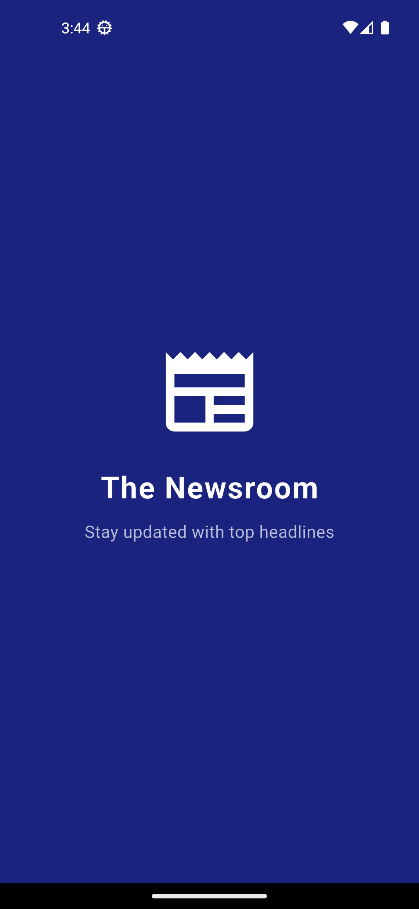
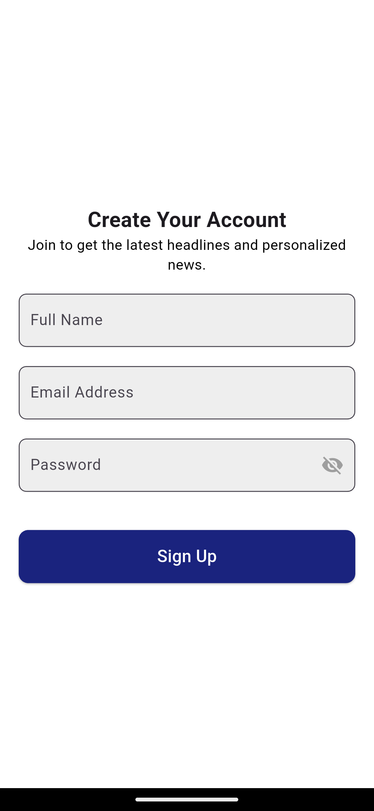
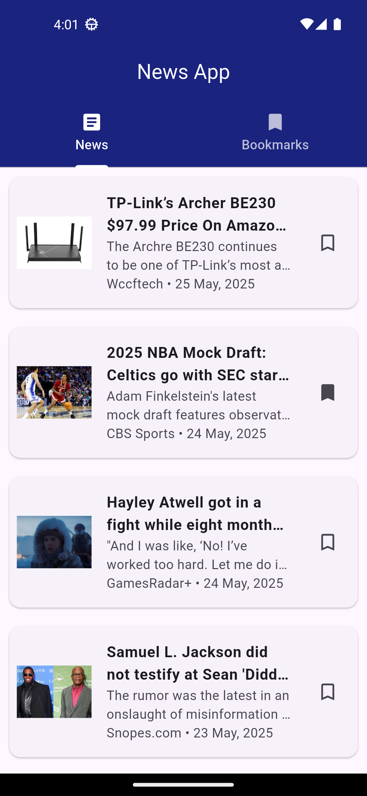
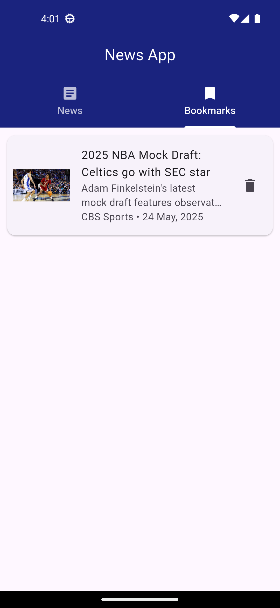

# 📰 NewsApp

A Flutter application that fetches and displays top headlines using the [GNews API](https://gnews.io). Users can read full articles inside the app using a WebView and bookmark their favorite articles. Bookmarks are stored locally and persist even after the app is closed.

---

## 🚀 Getting Started

This project is a starting point for a Flutter application.

If you're new to Flutter, here are some useful resources to get started:

- [Lab: Write your first Flutter app](https://docs.flutter.dev/get-started/codelab)
- [Cookbook: Useful Flutter samples](https://docs.flutter.dev/cookbook)
- [Flutter documentation](https://docs.flutter.dev/) — tutorials, samples, and API reference

---

## 🧠 Architecture

This app uses the **MVC (Model-View-Controller)** pattern for maintainability and separation of concerns:

- **Model:** Article data structures from the GNews API  
- **View:** UI screens including News Feed, Bookmarks, and Article WebView  
- **Controller:** Handles API calls, state updates, and storage logic  

Additional details:

- **State Management:** [`provider`](https://pub.dev/packages/provider)  
- **Persistent Storage:** [`shared_preferences`](https://pub.dev/packages/shared_preferences)  
- **Navigation:** TabBar with TabBarView  
- **WebView:** For displaying full articles  

> 🔍 **Note:** The app fetches news using the GNews search endpoint with parameters:
> 
> - `q=latest`  
> - `lang=en`  
> - `country=us`  
> - `max=10` (limits results to 10 articles)

---

## 🌐 API Details

**Endpoint example:**

"https://gnews.io/api/v4/search?q=latest&lang=en&country=us&max=10&apikey=57829ebf5e84c50f966c7a7e55c2f9b4"

**Query parameters:**

- `q=latest` — Search query term  
- `lang=en` — English language articles  
- `country=us` — Articles from the US  
- `max=10` — Maximum 10 articles  

The app displays the following information from each article:

- Title  
- Description  
- Image thumbnail  
- Source  
- Published date (formatted)

---

## 📦 Packages Used

| Package              | Purpose                      |
|----------------------|------------------------------|
| `http: ^1.4.0`         | REST API requests            |
| `provider: ^6.1.5`     | State management             |
| `shared_preferences: ^2.5.3` | Persistent local storage    |
| `webview_flutter: ^4.13.0`   | To view full articles       |
| `intl: ^0.20.2`        | Formatting published dates  |

## 📸 Screenshots

| Splash Screen                  | Signup Screen                | Home - NewsFeed              | Home - Bookmarks             | Article View                 |
|-------------------------------|-----------------------------|-----------------------------|-----------------------------|------------------------------|
|  |  |  |  |  |

 
## Google Drive Link

https://drive.google.com/drive/folders/1R3FucmwdUCSvaaCxLBCKPzUXExmVatLu